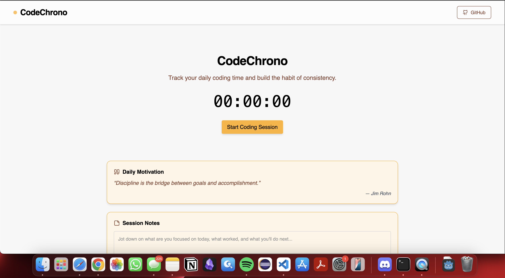

# DevPulse – Your Daily Development Session Logger

DevPulse is a personal productivity app that helps you log your daily development time, track progress, and stay consistent. It's designed for developers who want to build strong habits, stay motivated, and visualize their growth over time.

## Live Demo



[https://code-chrono.vercel.app/](https://code-chrono.vercel.app/)

---

## Features

- Track daily development time in minutes
- Full session management (add, edit, delete)
- Project and tag tracking per session
- Pomodoro mode with configurable work/break/cycles
- Heatmap calendar visualization of development streaks
- Daily goal setting and progress tracking
- Write and save session notes per day
- Badge unlock system for hitting milestones
- Weekly and monthly development summaries
- Smart analytics (rolling averages, goal hit rate, best hour/day, streak risk)
- Reminder system with browser notifications
- Cloud auth + cloud backup/restore support (Supabase)
- Export data as JSON or CSV
- Motivational quotes that rotate with time
- Modern, responsive UI with animations

---

## Tech Stack

- React.js
- Tailwind CSS
- Framer Motion
- Lucide React Icons
- Vite
- LocalStorage for state and persistence
- Deployed with Vercel

---

## Getting Started

To run this project locally:

```
git clone https://github.com/asifrahman2003/DevPulse
cd frontend
npm install
npm run dev
```

## Project Structure
```
frontend/
├── components/         // Reusable UI components
├── utils/              // Storage, analytics, reminders, and cloud helpers
├── App.jsx             // Main App layout
├── index.css           // Tailwind base styles
└── main.jsx            // App entry point
```

## Cloud Sync Setup (Optional)
Set these environment variables in `frontend/.env`:

```
VITE_SUPABASE_URL=your_supabase_project_url
VITE_SUPABASE_ANON_KEY=your_supabase_anon_key
```

Create a `user_data` table in Supabase:

```
create table if not exists public.user_data (
  user_id uuid primary key,
  payload jsonb not null,
  updated_at timestamptz not null default now()
);
```

With RLS enabled, allow users to read/write only their own row (where `auth.uid() = user_id`).

## Future Improvements
- PWA support for mobile use
- User leaderboard
- Browser extension integration

## Author
```
Asifur Rahman
- Portfolio: https://www.iamasiff.com
- LinkedIn: https://linkedin.com/in/iamasiff
- GitHub: https://github.com/asifrahman2003
```

## License
This project is licensed under the MIT License. 
